# Fish Dryer v2 🐟

**Version:** 2.0.0  
**Target Platform:** ESP32 (38-pin development board)  
**License:** MIT  
**Status:** Development

---

## 📋 Table of Contents

- [Project Overview](#-project-overview)
- [System Architecture](#-system-architecture)
- [Hardware Components](#-hardware-components)
- [Software Features & Logic](#-software-features--logic)
- [User Interface](#-user-interface)
- [Power & Energy Management](#-power--energy-management)
- [Data Logging & Monitoring](#-data-logging--monitoring)
- [Safety & Fail-Safes](#-safety--fail-safes)
- [Installation & Setup](#-installation--setup)
- [Serial Command Interface](#-serial-command-interface)
- [Configuration](#-configuration)
- [Contributing](#-contributing)
- [License & Contact](#-license--contact)

---

## 🎯 Project Overview

**Fish Dryer v2** is an advanced, modular ESP32-based control system designed for automated fish drying applications. The system combines precision temperature control, real-time weight monitoring, and intelligent automation to achieve optimal drying conditions while ensuring safety and energy efficiency.

### Key Highlights

- **Modular Architecture:** Independent, swappable hardware modules with centralized pin configuration
- **PID Temperature Control:** Automatic thermostat with tunable parameters (Kp=4.0, Ki=0.0, Kd=22.0)
- **Weight-Based Automation:** Load cell integration for water content calculation and automatic stop
- **Safety-First Design:** Sensor failure detection, thermal protection, and fail-safe relay control
- **Extensible Platform:** Easy integration with HMI displays, cloud logging, and power management systems
- **Non-Blocking Architecture:** Real-time responsiveness with millis()-based timing and event handling

### Target Applications

- Commercial fish drying operations
- Food preservation and dehydration
- Agricultural product drying
- Research and development testbeds

---

## 🏗️ System Architecture

The Fish Dryer v2 employs a centralized ESP32 controller managing multiple peripheral systems through digital and analog interfaces. The architecture prioritizes modularity, real-time control, and fault tolerance.


### Data Flow

1. **Input Layer:** Sensors continuously measure temperature, humidity, and weight
2. **Processing Layer:** ESP32 executes PID calculations and control logic every 2 seconds
3. **Output Layer:** SSR relays modulate heating and ventilation based on control signals
4. **Feedback Loop:** Temperature readings feed back into PID controller for closed-loop regulation

---

## 🔧 Hardware Components

### Bill of Materials

| Component | Model/Spec | Purpose | Interface | GPIO Pin(s) |
|-----------|------------|---------|-----------|-------------|
| **Microcontroller** | ESP32 38-Pin DevKit | Central controller | - | - |
| **SSR1** | Solid State Relay (rated for load) | Heating element control | Digital Output | 16 |
| **SSR2** | Solid State Relay | Convection fan control | Digital Output | 17 |
| **SSR3** | Solid State Relay | Exhaust fan control | Digital Output | 18 |
| **SHT31** | Sensirion SHT31-D | Temperature & humidity sensor | I2C (0x44) | SDA:21, SCL:22 |
| **HX711** | 24-bit ADC + Load Cell | Weight measurement | 2-Wire Serial | DOUT:34, SCK:27 |
| **Button 1-4** | Tactile push button (NO) | User input (short/long press) | Digital Input (Pullup) | 32, 33, 25, 26 |
| **Power Supply** | 5V/3A (minimum) | ESP32 and peripherals | - | - |
| **LiFePO4 Battery** | 300Ah 12V | Energy storage for off-grid operation | - | - |
| **Solar Panels** | 2x 300W (600W total) | Solar energy harvesting | - | - |
| **Charge Controller** | 40A MPPT | Solar battery charging | - | - |
| **Inverter** | 3000W | DC to AC conversion | - | - |
| **Solar Cables** | 10AWG+ (rated for current) | Power transmission | - | - |
| **Breakers** | DC rated (40A+ main, 10A branches) | Overcurrent protection | - | - |
| **LVD (Low Voltage Disconnect)** | 12V system compatible | Battery protection | - | - |

### Pin Assignment Table

#### Digital Outputs (SSR Control)

| Signal | GPIO | Function | Active State | Notes |
|--------|------|----------|--------------|-------|
| SSR1_PIN | 16 | Heating Element | HIGH = ON | High-power relay |
| SSR2_PIN | 17 | Convection Fan | HIGH = ON | Airflow circulation |
| SSR3_PIN | 18 | Exhaust Fan | HIGH = ON | Moisture exhaust |

#### Digital Inputs (Buttons)

| Signal | GPIO | Function | Active State | Detection |
|--------|------|----------|--------------|-----------|
| BUTTON1_PIN | 32 | User Button 1 | LOW (Pullup) | Short/Long press |
| BUTTON2_PIN | 33 | User Button 2 | LOW (Pullup) | Short/Long press |
| BUTTON3_PIN | 25 | User Button 3 | LOW (Pullup) | Short/Long press |
| BUTTON4_PIN | 26 | User Button 4 | LOW (Pullup) | Short/Long press |

#### I2C Bus (SHT31 Sensor)

| Signal | GPIO | Function | Protocol |
|--------|------|----------|----------|
| I2C_SDA_PIN | 21 | I2C Data | I2C (400kHz) |
| I2C_SCL_PIN | 22 | I2C Clock | I2C (400kHz) |

#### Load Cell Interface (HX711)

| Signal | GPIO | Direction | Notes |
|--------|------|-----------|-------|
| LOADCELL_DOUT_PIN | 34 | Input | Input-only GPIO acceptable |
| LOADCELL_SCK_PIN | 27 | Output | Clock signal to HX711 |

### Hardware Design Considerations

- **ESP32 Pin Safety:** Avoids flash pins (GPIO 6-11) and boot-critical pins
- **SSR Ratings:** Ensure SSRs are rated for heating element and fan loads (typically 10-40A for heating)
- **Load Cell Capacity:** Select load cell based on maximum product weight (e.g., 5kg, 10kg, 20kg)
- **Enclosure:** Use NEMA-rated enclosure if operating in humid environments
- **Thermal Management:** Provide adequate ventilation for ESP32 and SSRs during operation

### Wiring Diagram


For the interactive wiring diagram, visit: [Cirkit Designer](https://app.cirkitdesigner.com/project/edca0d0e-6361-4e7a-a81a-6921ec4fce70)

---

## 💻 Software Features & Logic

### Core Features

#### 1. PID Temperature Control

The system implements a **PID (Proportional-Integral-Derivative)** controller for precise temperature regulation within the drying chamber.

**PID Configuration:**
- **Kp (Proportional Gain):** 4.0 — Immediate response to temperature error
- **Ki (Integral Gain):** 0.0 — No integral action (disabled to prevent windup)
- **Kd (Derivative Gain):** 22.0 — Strong damping to prevent overshoot
- **Output Range:** 0 to 5000 (arbitrary units for relay control logic)
- **Update Interval:** 2000ms (2 seconds)

**Control Strategy:**
- When PID output > 0: Heating + Convection ON, Exhaust OFF
- When PID output ≤ 0: Heating + Convection OFF, Exhaust ON
- Default setpoint: 60°C (adjustable via serial command)


#### 2. Weight Monitoring & Automatic Stop

The HX711 load cell continuously monitors product weight to calculate water content loss and trigger automatic shutdown when target dryness is achieved.

**Weight-Based Control Logic:**
- Initial weight captured at start
- Continuous weight tracking during operation
- Water content percentage = `(Initial - Current) / Initial × 100`
- Auto-stop threshold configurable (e.g., 70% water loss)


#### 3. Button Interaction System

Four tactile buttons provide local user control with debouncing and press-duration detection.

**Button Features:**
- **Debounce Time:** 50ms — Eliminates mechanical noise
- **Short Press:** < 1000ms — Quick actions (start/stop, mode change)
- **Long Press:** ≥ 1000ms — Advanced functions (calibration, settings)
- **Non-Blocking:** `millis()`-based timing for real-time responsiveness

**Button Functions (Customizable):**

| Button | Short Press | Long Press |
|--------|-------------|------------|
| BTN1 (GPIO 32) | Start/Stop Drying Cycle | Enter Calibration Mode |
| BTN2 (GPIO 33) | Increase Setpoint (+5°C) | Reset to Default Setpoint |
| BTN3 (GPIO 25) | Decrease Setpoint (-5°C) | Tare Load Cell |
| BTN4 (GPIO 26) | Toggle Display Mode | System Diagnostics |

```mermaid
flowchart TD
    Start([Button Update Loop]) --> ReadAll[Read All 4 Button States]
    ReadAll --> Loop{For Each<br/>Button}
    Loop --> ReadPin[Read GPIO Pin State]
    ReadPin --> CheckChange{State Changed?}
    CheckChange -->|Yes| ResetDebounce[Reset Debounce Timer]
    CheckChange -->|No| CheckDebounce{Debounce Time<br/>Elapsed?}
    ResetDebounce --> Next([Next Button])
    CheckDebounce -->|No| Next
    CheckDebounce -->|Yes| UpdateState[Update Current State]
    UpdateState --> CheckPress{Pressed?<br/>LOW}
    CheckPress -->|Yes| StartTimer[Start Press Timer<br/>isPressed = true]
    CheckPress -->|No| CheckRelease{Was Pressed?}
    StartTimer --> CheckLongPress{Press Time<br/>≥ 1000ms?}
    CheckLongPress -->|Yes| TriggerLong[Trigger Long Press<br/>longPressTriggered = true]
    CheckLongPress -->|No| Next
    TriggerLong --> Next
    CheckRelease -->|Yes| CheckLong{Long Press<br/>Triggered?}
    CheckRelease -->|No| Next
    CheckLong -->|No| TriggerShort[Trigger Short Press<br/>Execute Action]
    CheckLong -->|Yes| ResetFlags[Reset Press Flags]
    TriggerShort --> ResetFlags
    ResetFlags --> Next
    Next --> Loop
```



#### 4. Non-Blocking Architecture

The entire system operates on a non-blocking event loop using `millis()` for timing, ensuring:
- Real-time button responsiveness
- Smooth PID updates without delays
- Concurrent sensor reading and relay control
- No `delay()` calls that would freeze execution

---

### Physical Button Control

Local control via 4 tactile buttons mounted on the enclosure:

- **Button 1:** Primary control (Start/Stop)
- **Button 2:** Temperature adjustment (Up)
- **Button 3:** Temperature adjustment (Down)
- **Button 4:** Mode/View toggle

All button actions are logged to serial for diagnostics.

---

## ⚡ Power & Energy Management

### Multi-Source Power Architecture

The Fish Dryer v2 is designed to operate with flexible power sources for off-grid or hybrid applications:

#### Supported Power Sources

1. **Solar Power**
   - **Panels:** 2x 300W monocrystalline panels (600W total)
   - **Charge Controller:** 40A MPPT controller for efficient charging
   - **Voltage:** 12V nominal system
   - **Expected Daily Energy:** ~3-4 kWh (depending on location and weather)
   - **Cabling:** 10AWG+ solar cables with proper MC4 connectors

2. **Battery Bank**
   - **Type:** LiFePO4 (Lithium Iron Phosphate)
   - **Capacity:** 300Ah at 12V (3600Wh total energy)
   - **Runtime:** ~3-5 hours continuous drying (at 650-1300W load)
   - **Cycle Life:** 2000+ cycles (10+ years with proper usage)
   - **Protection:** Built-in BMS (Battery Management System)
   - **Low Voltage Disconnect:** Automatic cutoff at ~10.5V to prevent damage

3. **Mains AC Power**
   - **Primary power source** for continuous operation
   - **Inverter:** 3000W pure sine wave for AC loads
   - **110V/220V AC** to 12V DC conversion
   - **Automatic failover** to battery backup during outages
   - **Breakers:** DC-rated circuit protection (40A main, 10A branches)

#### Power Consumption Profile

| Component | Power Draw | Duty Cycle | Avg. Consumption |
|-----------|------------|------------|------------------|
| ESP32 Controller | 500mW | 100% | 500mW |
| SHT31 Sensor | 1.5mW | 100% | 1.5mW |
| HX711 + Load Cell | 10mW | 100% | 10mW |
| Heating Element | 1000-2000W | 40-60% (PID) | 600-1200W |
| Convection Fan | 20-50W | 60-80% | 16-40W |
| Exhaust Fan | 20-50W | 20-40% | 4-20W |
| **Total System** | **~1100-2100W** | Variable | **~650-1300W** |

#### System Runtime Calculations (300Ah LiFePO4 Battery)

| Load Scenario | Power Draw | Runtime | Notes |
|---------------|------------|---------|-------|
| **Low Power Mode** | 650W | ~5.5 hours | Fans only, minimal heating |
| **Medium Load** | 1000W | ~3.6 hours | Balanced heating/fans |
| **High Load** | 1300W | ~2.8 hours | Maximum heating output |
| **Solar Replenish** | - | 2-4 hours | Full charge from 600W panels |

**Daily Operation Example:**
- 4 hours drying (1000W avg) = 4 kWh consumed
- 6 hours solar charging (600W panels) = 3.6 kWh generated
- Net: 0.4 kWh deficit (minimal battery draw)

#### Solar System Installation Guidelines

**Panel Mounting:**
- South-facing orientation (northern hemisphere)
- 30-45° tilt angle for optimal year-round performance
- Secure mounting to withstand wind loads
- Shade-free installation for maximum efficiency

**Cable Routing:**
- Use 10AWG or larger solar cable
- Minimize cable length to reduce voltage drop
- Proper MC4 connectors for weatherproofing
- Separate DC and AC cable runs

**Safety Considerations:**
- All DC connections behind breakers
- Ground-mounted system with proper earthing
- Lightning protection for exposed installations
- Regular maintenance and cleaning of panels
├── Fish Dryer (650-1300W)
├── Other Loads
└── LVD Protection
```

**Key Components:**
- **Solar Panels:** 2x 300W panels in series/parallel configuration
- **MPPT Controller:** 40A unit optimizes charging efficiency (95%+)
- **LiFePO4 Battery:** Deep cycle battery with built-in protection
- **Inverter:** 3000W pure sine wave for clean AC power
- **Breakers:** DC-rated for system protection
- **LVD:** Automatic disconnect prevents battery damage

#### Battery Management & Safety

**LiFePO4 Advantages:**
- **Long Cycle Life:** 2000+ charge cycles vs. 500 for lead-acid
- **High Efficiency:** 95%+ charge/discharge efficiency
- **Safe Chemistry:** Stable lithium iron phosphate technology
- **Wide Temperature Range:** -20°C to 60°C operating range
- **Lightweight:** ~40% lighter than equivalent lead-acid

**Charging Parameters:**
- **Bulk Voltage:** 14.2-14.6V (MPPT controller managed)
- **Float Voltage:** 13.6V (maintenance charging)
- **Max Charge Current:** 40A (limited by MPPT controller)
- **Temperature Compensation:** Automatic adjustment for optimal charging


## 📊 Data Logging & Monitoring

### Logging Capabilities

The system supports multiple logging backends for data persistence and analysis:

#### 1. Serial Logging (Default)

- **Baud Rate:** 115200
- **Format:** Human-readable text with timestamps
- **Data Points:** All sensor readings, relay states, PID output, button events
- **Use Case:** Real-time debugging and development

#### 2. HMI Display Logging

- **Protocol:** UART or ESP-NOW
- **Format:** Tagged data packets for display parsing
- **Retention:** Display-side storage (SD card on HMI)
- **Use Case:** Operator monitoring and historical review

#### 3. SD Card Logging (Future Enhancement)

- **Module:** SPI SD card reader
- **Format:** CSV with Unix timestamps
- **Fields:** `timestamp, temp, humidity, weight, water_loss_pct, pid_output, heater, fan, exhaust`
- **Rotation:** Daily files with automatic rollover

### Logged Parameters

| Parameter | Unit | Precision | Sample Rate | Description |
|-----------|------|-----------|-------------|-------------|
| Temperature | °C | 0.1 | 2s | Chamber air temperature |
| Humidity | % | 0.1 | 5s | Relative humidity |
| Weight | kg | 0.01 | 5s | Current product weight |
| Water Loss | % | 1 | 5s | Calculated drying progress |
| PID Output | units | 1 | 2s | Controller output signal |
| Heater State | bool | - | Event | ON/OFF state change |
| Fan State | bool | - | Event | ON/OFF state change |
| Exhaust State | bool | - | Event | ON/OFF state change |
| Runtime | seconds | 1 | 1s | Total operation time |
| Power Source | enum | - | Event | SOLAR/BATTERY/MAINS |


## 🛡️ Safety & Fail-Safes

### Sensor Failure Handling

The system implements robust error detection and fail-safe responses:

#### SHT31 Temperature Sensor Failure


**Fail-Safe Actions:**
- Immediate heater cutoff to prevent overheating
- Exhaust fan activation for rapid cooling
- PID control disabled
- Visual and serial alert

**Fail-Safe Actions:**
- Immediate heater cutoff to prevent overheating
- Exhaust fan activation for rapid cooling
- PID control disabled
- Visual and serial alert
- System enters safe mode until sensor recovery or manual reset

#### HX711 Load Cell Failure

**Detection Method:**
- `scale.is_ready()` check before each reading
- Consecutive read failures trigger alert

**Response:**
- Continue temperature control (drying can proceed without weight monitoring)
- Disable automatic stop feature
- Log warning to serial/HMI
- Operator must manually monitor drying progress

### Electrical Safety

- **SSR Isolation:** Optocoupler-based SSRs provide galvanic isolation between ESP32 logic and high-voltage loads
- **Overcurrent Protection:** Circuit breakers on mains input

### Operational Safety Features

| Feature | Implementation | Purpose |
|---------|----------------|---------|
| **Sensor Watchdog** | 3 consecutive read failures → shutdown | Prevent blind operation |
| **Overheat Cutoff** | Software limit at 85°C (configurable) | Thermal protection |
| **Manual Emergency Stop** | Button 1 long-press → immediate shutdown | Operator safety |
| **Power-On Self-Test** | Sensor checks at boot | Early fault detection |
| **Graceful Shutdown** | Turn off heater before fans | Prevent residual heat buildup |

---

## 🚀 Installation & Setup

### Prerequisites

- **Arduino IDE:** Version 1.8.19 or newer (or PlatformIO)
- **ESP32 Board Support:** Install via Arduino Board Manager
- **Required Libraries:**
  - [PID_v1](https://github.com/br3ttb/Arduino-PID-Library) (v1.2.1+)
  - [Adafruit SHT31](https://github.com/adafruit/Adafruit_SHT31) (v2.2.0+)
  - [HX711](https://github.com/bogde/HX711) (v0.7.5+)

### Installation Steps

#### 1. Clone Repository

```powershell
git clone https://github.com/qppd/fish-dryer-v2.git
cd fish-dryer-v2
```

#### 2. Install Arduino Libraries

**Via Arduino IDE Library Manager:**
1. Open Arduino IDE
2. Go to **Sketch → Include Library → Manage Libraries**
3. Search and install:
   - `PID by Brett Beauregard`
   - `Adafruit SHT31 Library`
   - `HX711 Arduino Library by Bogdan Necula`

**Via PlatformIO:**

```ini
[env:esp32dev]
platform = espressif32
board = esp32dev
framework = arduino
lib_deps = 
    br3ttb/PID@^1.2.1
    adafruit/Adafruit SHT31 Library@^2.2.0
    bogde/HX711@^0.7.5
```

#### 3. Configure Hardware Pins

Review `src/esp/FishDryer/PINS_CONFIG.h` and adjust GPIO assignments to match your hardware:

```cpp
// Example: Change SSR1 pin from 16 to 23
#define SSR1_PIN 23
```

#### 4. Upload Firmware

1. Open `src/esp/FishDryer/FishDryer.ino` in Arduino IDE
2. Select **Board:** "ESP32 Dev Module"
3. Select **Upload Speed:** 115200
4. Select **COM Port:** (your ESP32 port)
5. Click **Upload** ⬆️

#### 5. Verify Operation

1. Open **Serial Monitor** at **115200 baud**
2. Reset ESP32
3. Verify initialization messages:
   ```
   SSR_CONFIG loaded. SSR1_PIN, SSR2_PIN, and SSR3_PIN set as OUTPUT.
   SHT31 sensor initialized.
   HX711 load cell initialized.
   Buttons initialized with INPUT_PULLUP.
   PID controller initialized.
   ```

---

## 📡 Serial Command Interface

The system provides a comprehensive serial command interface for testing, calibration, and remote control.

### Command Reference

#### Relay Control

| Command | Function | Response |
|---------|----------|----------|
| `SSR1:1` | Turn ON Heating Element (GPIO 16) | `SSR1_PIN set HIGH` |
| `SSR1:0` | Turn OFF Heating Element | `SSR1_PIN set LOW` |
| `SSR2:1` | Turn ON Convection Fan (GPIO 17) | `SSR2_PIN set HIGH` |
| `SSR2:0` | Turn OFF Convection Fan | `SSR2_PIN set LOW` |
| `SSR3:1` | Turn ON Exhaust Fan (GPIO 18) | `SSR3_PIN set HIGH` |
| `SSR3:0` | Turn OFF Exhaust Fan | `SSR3_PIN set LOW` |

#### Sensor Readings

| Command | Function | Response Example |
|---------|----------|------------------|
| `SHT31:READ` | Read temperature and humidity | `SHT31 Temp: 58.2 C, Humidity: 45.3 %` |
| `LOADCELL:READ` | Read raw load cell value | `Load cell reading: 823456` |
| `BUTTONS:READ` | Read all button states | `BTN1: RELEASED` `BTN2: PRESSED` ... |

#### PID Control

| Command | Function | Response Example |
|---------|----------|------------------|
| `PID:START` | Enable PID thermostat control | `PID thermostat control ENABLED. System will maintain temperature automatically.` |
| `PID:STOP` | Disable PID control | `PID thermostat control DISABLED.` |
| `PID:SET:65.0` | Set temperature setpoint to 65.0°C | `Temperature setpoint set to: 65.0` |
| `PID:READ` | Read PID status and values | `PID Status: ENABLED \| Current Temp: 58.2 \| Setpoint: 60.0 \| PID Output: 3245` |

### Usage Examples

#### Test Heating Element
```
> SSR1:1
< SSR1_PIN set HIGH
(Wait 10 seconds)
> SHT31:READ
< SHT31 Temp: 35.2 C, Humidity: 42.1 %
> SSR1:0
< SSR1_PIN set LOW
```

#### Calibrate Load Cell
```
> LOADCELL:READ
< Load cell reading: 823456
(Remove all weight)
> LOADCELL:READ
< Load cell reading: 8203
(Add known weight, e.g., 1kg)
> LOADCELL:READ
< Load cell reading: 431287
```

#### Start Automatic Drying
```
> PID:SET:60
< Temperature setpoint set to: 60.0
> PID:START
< PID thermostat control ENABLED. System will maintain temperature automatically.
> PID:READ
< PID Status: ENABLED | Current Temp: 28.5 | Setpoint: 60.0 | PID Output: 4523
```

---

## ⚙️ Configuration

### PID Tuning

The PID controller can be tuned for different drying chamber characteristics by modifying `PID_CONFIG.h`:

```cpp
// PID tuning parameters
#define PID_KP 4.0   // Proportional gain
#define PID_KI 0.0   // Integral gain
#define PID_KD 22.0  // Derivative gain
```

**Tuning Guidelines:**

| Parameter | Effect | Increase If | Decrease If |
|-----------|--------|-------------|-------------|
| **Kp** | Immediate response | Slow to reach setpoint | Oscillates rapidly |
| **Ki** | Eliminates steady-state error | Persistent offset error | Overshoot/instability |
| **Kd** | Damping/smoothing | Overshoot on changes | Too sluggish |

**Recommended Starting Points:**
- Small chamber (< 0.5 m³): Kp=2.0, Ki=0.5, Kd=10.0
- Medium chamber (0.5-2 m³): Kp=4.0, Ki=0.0, Kd=22.0 (current)
- Large chamber (> 2 m³): Kp=6.0, Ki=0.2, Kd=30.0

### Load Cell Calibration

To calibrate the HX711 load cell for accurate weight readings:

1. **Tare (Zero) Calibration:**
   ```cpp
   scale.tare();  // Add to setup() after initLoadCell()
   ```

2. **Scale Factor Calibration:**
   ```cpp
   scale.set_scale(2280.f);  // Calibration factor (adjust based on testing)
   float weight = scale.get_units(10);  // Average of 10 readings
   ```

3. **Calibration Procedure:**
   - Remove all weight from platform
   - Call `scale.tare()`
   - Place known weight (e.g., 1.000 kg)
   - Read raw value with `scale.read_average(10)`
   - Calculate factor: `calibration_factor = raw_value / known_weight`
   - Update `set_scale(calibration_factor)`

### Button Function Customization

Edit `BUTTON_CONFIG.h` to customize button actions:

```cpp
void handleShortPress(int buttonIndex) {
  switch(buttonIndex) {
    case 0: // Button 1
      PID_ENABLED = !PID_ENABLED;
      Serial.println(PID_ENABLED ? "PID Started" : "PID Stopped");
      break;
    case 1: // Button 2
      TEMPERATURE_SETPOINT += 5.0;
      Serial.print("Setpoint: ");
      Serial.println(TEMPERATURE_SETPOINT);
      break;
    // ... add your custom actions
  }
}
```

---

## 📈 Project Roadmap

### Current Version: v2.0.0

- ✅ Modular configuration architecture
- ✅ PID temperature control
- ✅ Load cell integration
- ✅ Button input system
- ✅ Serial command interface

### Planned Features (v2.1.0)

- ⬜ HMI display integration (Nextion/ESP-NOW)
- ⬜ SD card data logging
- ⬜ Battery voltage monitoring
- ⬜ Automatic water loss calculation
---

## 🤝 Contributing

Contributions are welcome! Please follow these guidelines:

### Development Workflow

1. **Fork** the repository
2. Create a **feature branch**: `git checkout -b feature/amazing-feature`
3. **Commit** your changes: `git commit -m 'Add amazing feature'`
4. **Push** to branch: `git push origin feature/amazing-feature`
5. Open a **Pull Request**

### Code Standards

- Follow Arduino/C++ style conventions
- Comment all hardware-specific configurations
- Include docstrings for new functions
- Test on real hardware before submitting
- Update README.md if adding user-facing features

### Reporting Issues

Use GitHub Issues with the following labels:
- `bug` - Software defects
- `hardware` - Hardware compatibility issues
- `enhancement` - Feature requests
- `documentation` - Docs improvements

---

## 📄 License & Contact

### License

This project is licensed under the **MIT License**. See the `LICENSE` file for full terms.

### Project Information

- **Repository:** [github.com/qppd/fish-dryer-v2](https://github.com/qppd/fish-dryer-v2)
- **Version:** 2.0.0
- **Status:** Development
- **Maintained by:** QPPD Dev Community

### Contact & Support

- **Email:** quezon.province.pd@gmail.com
- **GitHub:** [github.com/qppd](https://github.com/qppd)
- **Portfolio:** [sajed-mendoza.onrender.com](https://sajed-mendoza.onrender.com)
- **Facebook:** [facebook.com/qppd.dev](https://facebook.com/qppd.dev)
- **Community:** [facebook.com/QUEZONPROVINCEDEVS](https://facebook.com/QUEZONPROVINCEDEVS)

### Acknowledgments

Built with:
- **ESP32** by Espressif Systems
- **Arduino** framework and community libraries
- **PID_v1** by Brett Beauregard
- **Adafruit SHT31** library
- **HX711** library by Bogdan Necula

---

## 🔍 Troubleshooting

### Common Issues

#### Issue: SHT31 Sensor Not Found

**Symptoms:**
```
Couldn't find SHT31 sensor!
```

**Solutions:**
1. Check I2C wiring (SDA:21, SCL:22)
2. Verify sensor I2C address (default 0x44, alternative 0x45)
3. Add pull-up resistors (4.7kΩ) to SDA and SCL lines
4. Test with I2C scanner sketch

#### Issue: Load Cell Returns Erratic Values

**Symptoms:**
```
Load cell reading: 823456
Load cell reading: 11234
Load cell reading: 923487
```

**Solutions:**
1. Check wiring connections (loose wires cause noise)
2. Move HX711 away from high-power lines (EMI interference)
3. Add ferrite bead on load cell cable
4. Use shielded cable for load cell wiring
5. Increase averaging: `scale.read_average(20)`

#### Issue: PID Oscillates Wildly

**Symptoms:**
- Temperature swings ±10°C around setpoint
- Relay chatter (rapid on/off cycles)

**Solutions:**
1. Reduce Kp gain (try Kp=2.0)
2. Increase Kd gain (try Kd=30.0)
3. Increase PID update interval to 5000ms
4. Check for poor thermal contact between sensor and chamber

#### Issue: ESP32 Won't Boot After Upload

**Symptoms:**
- Brown-out detector triggered
- Continuous restart loop

**Solutions:**
1. Check power supply capacity (minimum 2A)
2. Add bulk capacitor (100-1000µF) near ESP32 VIN
3. Ensure SSRs are not back-feeding voltage to ESP32
4. Try different USB cable (some have high resistance)

---

## 📚 Additional Resources

### Technical Documentation

- [ESP32 Datasheet](https://www.espressif.com/sites/default/files/documentation/esp32_datasheet_en.pdf)
- [SHT31 Datasheet](https://www.sensirion.com/media/documents/213E6A3B/63A5A569/Datasheet_SHT3x_DIS.pdf)
- [HX711 Datasheet](https://cdn.sparkfun.com/datasheets/Sensors/ForceFlex/hx711_english.pdf)
- [PID Control Theory](https://en.wikipedia.org/wiki/PID_controller)

### Related Projects

- [ESP32 PID Examples](https://github.com/lbernstone/ESP32_PID)
- [Arduino SSR Control](https://www.arduino.cc/en/Tutorial/Foundations/ControllingSSR)
- [Food Dehydrator Controllers](https://www.instructables.com/Arduino-Controlled-Food-Dehydrator/)

### Community Support

- [ESP32 Forum](https://www.esp32.com/)
- [Arduino Forum](https://forum.arduino.cc/)
- [Reddit r/esp32](https://www.reddit.com/r/esp32/)

---

<div align="center">

**Fish Dryer v2** — Built with ❤️ by the QPPD Dev Community

⭐ Star this repo if you find it useful!

</div>
